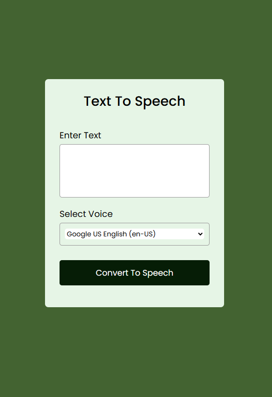

# Text-To-Speech-Web-Application
A simple and interactive Text-to-Speech (TTS) web application that converts written text into spoken words using the browser's built-in Web Speech API.

This project allows users to type or paste text into a text area and have it read aloud by the browser.

Users can also select from the available voices provided by their browser or operating system before starting the speech.

I built this project as part of my journey to strengthen my JavaScript fundamentals and gain more experience building interactive web applications.

## Preview

## Live Demo
[View the Live Text-To-Speech App](https://neyethedevanalyst.github.io/Text-To-Speech-Web-Application/)

### Features
- Enter or paste text into the text area
- Convert text into speech
- Select from available system voices
- Start speech playback with a button
- Uses the browser's built-in Speech Synthesis API
- Responsive and simple user interface

### Technologies Used
- HTML5 – Structure of the application
- CSS3 – Styling and layout
- JavaScript – Application logic and user interactions
- Web Speech API – Text-to-speech functionality

### How It Works
The application uses JavaScript's SpeechSynthesis API to convert text into speech.

When the user enters text and clicks the speech button:

JavaScript retrieves the text from the textarea.
A SpeechSynthesisUtterance object is created.
The selected voice is assigned to the utterance.
The browser's Speech Synthesis API reads the text aloud.

The available voices are retrieved from the user's browser and operating system.

### How to Run the Project
1. Clone the repository
git clone https://github.com/yourusername/text-to-speech.git
2. Open the project - Navigate to the project folder and open index.html in your browser - You can also use VS Code with Live Server to run the application locally.
3. Use the application - Enter your text in the text area. - Select your preferred voice. - Click the speech button. - Listen as the browser reads your text aloud.
📂
### Project Structure
text-to-speech/
- index.html
- style.css
- script.js

### What I Learned

Through this project, I practiced:

Selecting HTML elements using JavaScript
Working with the DOM
Handling button and change events
Using querySelector()
Working with arrays and loops
Creating and using JavaScript objects
Using the SpeechSynthesisUtterance API
Retrieving available voices with speechSynthesis.getVoices()
Updating HTML elements dynamically
Connecting JavaScript functionality to a user interface

### Future Improvements

Some features I would like to add in the future include:

Speech speed control

Volume control

Pitch control

Pause and resume functionality

Stop speech functionality

Better mobile responsiveness

Character or word counter

Improved voice filtering by language

### Purpose

This project is part of my web development learning journey and was created to gain practical experience with JavaScript and browser APIs by building a functional application from scratch.

### Author

#### Matilda Eyubeh

#### Full Stack Developer | Data Analyst
